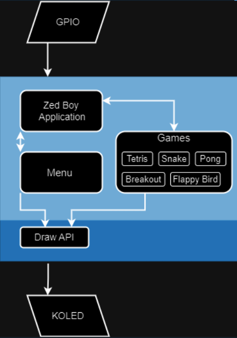

# zedBoy

####

## Abstract

For our project, we plan to develop a Game System for the ARM Cortex-A9 Zedboard Zynq-7000 development board. This will implement a driver for the on-board OLED screen (ug-2832hsweg04) for setting up and drawing to the screen, as well as a draw.h library for simple graphics. This library will be used in the development of several games such as Snake, Tetris, Pong, and Breakout and will allow for the implementation of new games as desired by the user.

## Introduction

The project is an example of an embedded system, combining kernel-space device creation with user-space access to the internal hardware, allowing a user to interact with the on-board OLED screen.

People who use the same development board will find that there is no easy way to interact with the OLED screen, and similar implementations are purely user-space without any extended drawing API, only offering a function to draw pixels individually.

We aim to simplify the game creation process by making a modular system that allows the easy addition of new games.

## Related Work

There is a similar library known as Libzed, which allows for simplistic use of the functions on the development board. Some of the included functionality is GPIO access and editing, hardware-specific peripheral mapping information, and OLED screen implementation. Although their implementation is not available, we took inspiration from the structure of available APIs.

## System Diagram

## Contributions

- **Jakob Brattke** (brattke.j@northeastern.edu)

Worked on creating games for the zedBoy application, including [Pong](/zedboy/games/pong) and the not fully implemented [Flappy Bird](/zedboy/games/flappy). Also worked on menu controls and registering games to the zedBoy application in a modular fashion, [gameConstants](/zedboy/utils).

- **Thane Gallo** (thanegallo1@gmail.com)

Developed the [kOLED.ko](kOLED/) module to create a character device that sends a buffer to fill the graphical display RAM and updates the OLED screen accordingly. Also developed the [draw](/zedboy/utils) library for OLED device management, including functions to open, close, and write text and shapes to the graphical device RAM. Helped move Pong and Tetris from their terminal implementations to the zedBoy application.

- **Dmitry Matveev** (matveev.d@northeastern.edu)

Created several games for the zedBoy application, specifically [Breakout](/zedboy/games/breakout), [Snake](/zedboy/games/snake), and [Tetris](/zedboy/games/tetris). Integrated all the games to draw on the OLED screen using the [draw](/zedboy/utils/) library developed for the project.

- **Sym Cunningham** (sym.cunningham@gmail.com)

## Implementation Progress

We successfully created a system that allows for easy game creation and implementation. The OLED screen was controlled, and the draw.h library was used to draw shapes and text to the screen. The gameConstants.h file was used to register games in the zedBoy application. We created four fully implemented and functional games: Snake, Pong, Tetris, and Breakout. The games were playable on the OLED screen, and GPIO buttons were used for controls. Although the user experience could be smoother, our overall project goals were met.

## Future Work

In the future, we aim to improve the user experience of the games, including enhancing the responsiveness of controls and game speed. One extension would be to create more games and integrate them into the zedBoy application. Another improvement could be developing a more user-friendly menu system that supports additional games.

Further reach goals include implementing a leaderboard/high score system, adding sound effects, and incorporating multiplayer support into the console (and applying it to certain games).

## Experimental Results

The controls were implemented using a polling mechanism for the control buttons' state. This caused errors and decreased responsiveness, as it only read the last input when the polling tick occurred, leading to "ghost" inputs before the game control activated and the graphics updated. The polling also significantly increased CPU utilization as it was much faster than the screen could update. By reducing the polling rate, CPU utilization dropped by 10%, though the control system could benefit from further redesign.

Each game ran at a similar frame rate (4.25 frames per second), and we believe the main slowdown is due to the OLED screen. The screen is half-duplex, requiring 16 bytes of meaningless data to be sent back to the SPI peripheral for each 16-byte write to prevent an RX overrun error. While this setup can't be changed due to the development board's wiring, a software optimization would be to only update pixels that change between frames rather than clearing and redrawing the entire screen buffer. This could lead to noticeable performance improvements.
