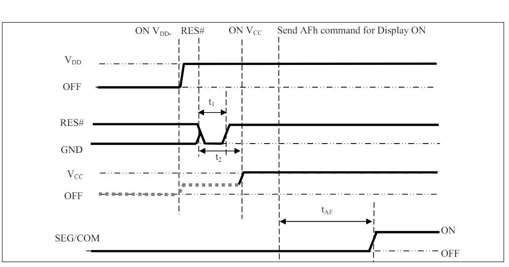

# kOLED.ko

## How to use

First, you must make and insert the kernel module using the following command: 

```bash
insmod kOLED.ko
```

Then use the [draw library](../zedboy/utils/draw.h) to open the OLED device and begin writing to the userspace buffer which allows you to draw one frame at a time. After the frame is drawn one would use sendBuffer() in order to write to the module and update the screen. 

## Design

### Setup
The OLED screen needs two different sets of memory mapped to be able to access and write information to it. First, we must follow the OLED screen datasheet for the power on sequence which can be seen below:



We edit these values using the corresponding GPIO peripheral on the board and are able to send commands once it is initilized.

Next the SPI module is required to be set up and initialized as it is the only way to communicate with the OLED given the way the FPGA is set up. We need to send the set of setup commands to the OLED using the character device set up earlier depening on the state of the data/command pin. This setup is the standard setup given on the OLED screens datasheet given and allows for the entire screen to be written to.

An array written to the character device is the size of the number of bytes of the GDDRAM (512). This array fills the RAM with the state of each pixel with each byte controlling 8. In order to simplify the drawing for the user a draw library is implimented.

### Connecting the Driver to the Userspace

As this is intended to be for game development the internals of the OLED module are not able to be modified from the userspace. So the commands in order to change values such as contrast, scrolling, and toggle inverted mode will not be accessable. This is done to streamline the experience and make it so the user has less to worry about while simultaneously being able to draw and send whatever is desired.
